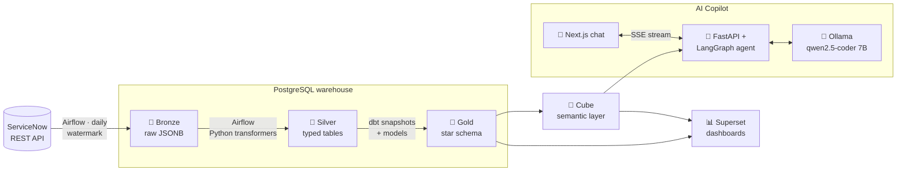

<div align="center">

# 🎫 SN Analytics

**A full data platform for ServiceNow customer-service cases. It extracts case data, models it into a warehouse, puts it on dashboards, and lets you ask questions about it in plain English.**

*Projet de Fin d'Études (PFE)*

[](https://github.com/nour-saied/sn_analytics_pfe/actions/workflows/ci.yml)


</div>

---

## ✨ What it does

Support teams working in ServiceNow usually can't answer questions like *"are we breaching our response SLA more on high-priority cases?"* or *"which terminals generate the most incidents?"* without exporting spreadsheets by hand. This project automates the whole path from the ServiceNow API to an answer:

- 🔄 **Incremental extraction.** Airflow pulls cases, SLAs, users and contracts from the ServiceNow REST API every day. A watermark means each run only fetches records that changed.
- 🥉🥈🥇 **Medallion warehouse.** Raw JSON lands in **bronze**, typed and cleaned rows in **silver**, and a **gold** star schema built with dbt, including SCD2 snapshots that record every status change.
- 🧊 **Semantic layer.** Cube defines the business metrics (breach rate, time to first response, backlog…) once, so dashboards and the AI agent use the same definitions.
- 📊 **Dashboards.** A 29-chart Superset dashboard covering SLA breaches, backlog aging, agent leaderboards, arrival heatmaps and more. It's kept in git as YAML.
- 🤖 **AI Copilot.** A chat app where you ask questions in natural language. A LangGraph agent running a **local** LLM (Ollama, no data leaves the machine) turns them into Cube queries and replies with tables.
- ✅ **CI/CD.** GitHub Actions runs lint and unit tests, builds the whole dbt gold layer on synthetic seeds, runs the dbt tests, and pushes 5 Docker images to GHCR.

---

## 🏗️ Architecture



### The gold star schema

| Table | Purpose |
|---|---|
| `fact_case` | One row per case: priority, category, state, timestamps, response/resolution SLA outcomes |
| `fact_case_status_history` | Every state change, built from dbt SCD2 snapshots |
| `dim_agent` | Support agents (used in 5 roles: opened by, assigned to, resolved by…) |
| `dim_assignment_group` | Support teams |
| `dim_terminal` | Parking terminals and device types |
| `dim_date` | Calendar dimension (used in 6 roles) |

All of these role-playing joins are written **once** in Cube (`cube/model/cubes/`), so nothing downstream writes them by hand.

---

## 🤖 The Copilot

Ask a question → the agent finds the right Cube members → runs the query → answers with a table and shows the tool calls it made.

> **You:** What's the response SLA breach rate by priority this year?
>
> **Copilot:** *calls `list_cube_metrics` → `run_cube_query`* → returns a table of breach rates per priority, with a short summary.

How it works:
- The agent uses **Cube first** and only falls back to guarded, read-only SQL (`list_tables`, `describe_table`, `sample_values`, `run_sql`) when Cube doesn't model the question.
- Member names and filter values are **checked before a query is sent**, so a made-up field name is rejected instead of silently returning wrong data.
- Conversations are kept per thread in a SQLite checkpointer, and responses stream token by token.
- Questions it can't answer from the data are declined instead of answered with a guess.

### 📏 It's measured

`copilot/eval/` holds a reproducible benchmark: 26 questions, each with a reference SQL answer, scored automatically over 3 runs, plus a separate held-out set.

| Round | Accuracy | Median latency | p95 latency |
|---|---:|---:|---:|
| Baseline | 76.9 % (60/78) | 22.0 s | 77.2 s |
| After tuning (round 2) | **92.3 % (72/78)** | **15.1 s** | **35.3 s** |
| Held-out questions (never tuned on) | 66.7 % (24/36) | 15.6 s | 26.0 s |

Round 2 scored 100 % on counts, KPIs, breakdowns and case-history questions. The weak spots are time filters and out-of-scope detection, and the held-out gap shows how much work is left on generalisation. All of this is on a 7B quantised model running partly on a 4 GB laptop GPU.

```bash
cd copilot/eval
python run_eval.py 1                                      # ask every question (run id "1"); writes results/latest/
python score.py "results/latest/results_run[0-9].jsonl"   # score runs against ground_truth.json
```

---

## 🚀 Getting started

### Prerequisites
- Docker and Docker Compose
- ~16 GB RAM recommended (Airflow, Superset, Cube, Ollama and Postgres all run at once)
- *(Optional)* An NVIDIA GPU for faster LLM inference
- ServiceNow instance credentials

### 1. Configure
Create a `.env` file at the repo root. `docker-compose.yml` reads, among others:

```dotenv
# Warehouse
ELT_DATABASE_NAME=...        ELT_DATABASE_USERNAME=...    ELT_DATABASE_PASSWORD=...
POSTGRES_CONN_HOST=postgres  POSTGRES_CONN_PORT=5432
# Airflow
AIRFLOW_UID=50000            FERNET_KEY=...
# Superset / Cube / Copilot
SUPERSET_SECRET_KEY=...      CUBEJS_API_SECRET=...
COPILOT_DB_USERNAME=...      COPILOT_DB_PASSWORD=...      # read-only role
# ServiceNow credentials: see etl_core/api/config.py
```

### 2. Launch
```bash
docker compose up -d --build
docker exec -it ollama ollama pull qwen2.5-coder:7b-instruct-q4_K_M
```

### 3. Explore

| Service | URL |
|---|---|
| 🌀 Airflow | http://localhost:8080 |
| 📊 Superset | http://localhost:8088 |
| 🧊 Cube Playground | http://localhost:4000 |
| 💬 Copilot | http://localhost:3000 |
| ⚙️ Copilot API | http://localhost:8000 |

Trigger the DAGs in order: `sn_account_bronze_ingestion` → `sn_bronze_to_silver` → `gold_build`. After that they run on their daily schedule. To load the dashboard, import `superset/exports/cases_analytics_dashboard` (see [its README](superset/exports/README.md)).

---

## 🧪 Development

```bash
pip install -r requirements.txt -r requirements-dev.txt
ruff check etl_core/ dags/ tests/
pytest

# dbt against the synthetic CI seeds (no ServiceNow access needed)
cd dbt
dbt seed --profiles-dir . --select tag:ci_only
dbt snapshot --profiles-dir .
dbt run  --profiles-dir . --select gold
dbt test --profiles-dir . --select gold
```

---

## 📁 Project layout

```
├── dags/              Airflow DAGs: bronze extract → silver transform → gold build
├── etl_core/          Python ETL library: ServiceNow client, loaders, transformers
├── dbt/               Gold star schema: models, SCD2 snapshots, tests, CI seeds
├── cube/              Semantic layer: cubes, measures, role-playing joins
├── superset/exports/  Dashboard, charts and datasets as version-controlled YAML
├── copilot/
│   ├── backend/       FastAPI + LangGraph agent, tools, schema docs
│   ├── frontend/      Next.js + Tailwind + shadcn/ui chat interface
│   └── eval/          Benchmark questions, ground truth, runner, scorer, results
├── docker/            Dockerfiles for Superset and dbt, Postgres init script
├── docs/              Data dictionary, field mappings, dbt onboarding notes
└── tests/             Unit tests for the silver transformer and watermark loader
```

📚 More detail: [data dictionary](docs/data_dictionary.md) · [data mapping](docs/data_mapping.md) · [dbt onboarding](docs/dbt_onboarding.md) · [docs overview](docs/README.md)

---

<div align="center">

Built by **Nour Saied** as a final-year engineering project 🎓

</div>
